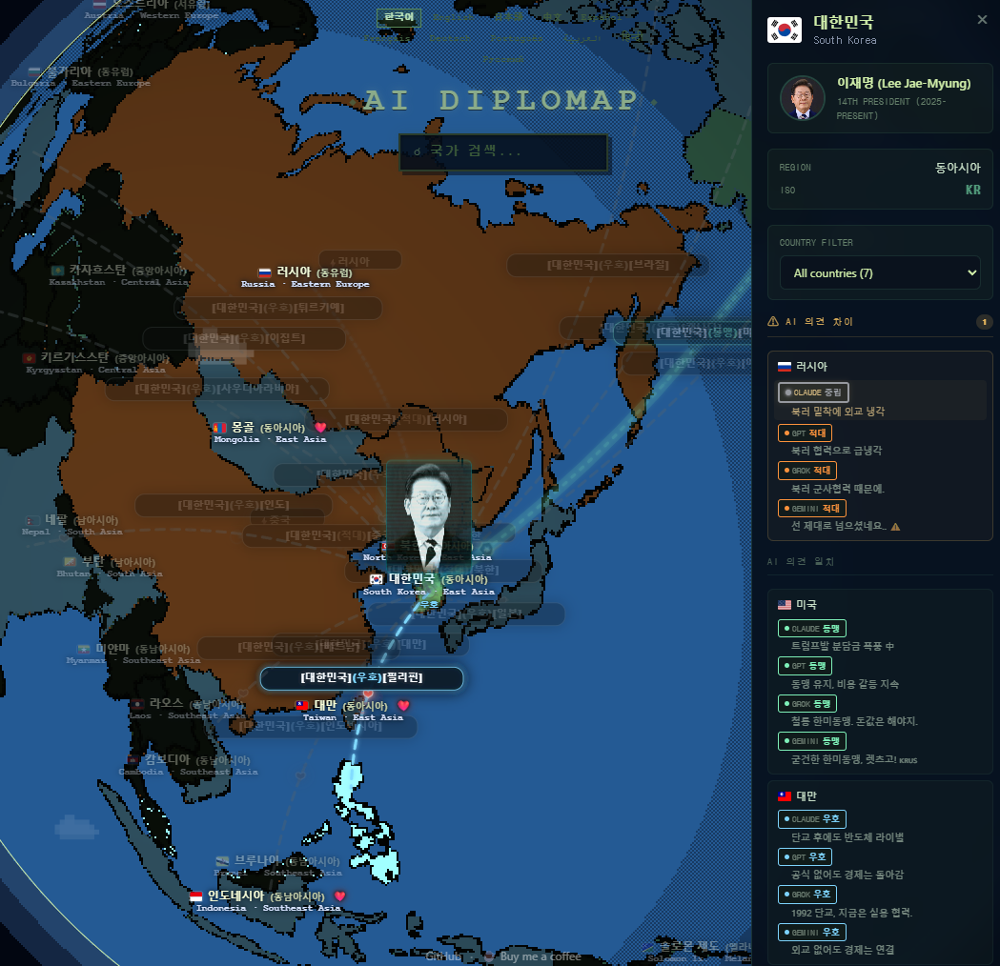

# AI DIPLOMAP

국가 간 관계를 지도 위에서 시각화하고, AI 모델별 해석 차이를 비교하는 프로젝트입니다.



## Demo
[https://ai-diplomap.vercel.app/](https://ai-diplomap.vercel.app/)

## Tech Stack
- Vue 3
- Vite
- Pinia
- TypeScript
- Bun

## Run Locally
```bash
bun install
bun run dev
```

## Build
```bash
bun run build
```

## Data Structure
관계 데이터는 `src/data/relation/*.json`에 저장됩니다.

```json
{
  "countryCode": "KP",
  "relations": [
    {
      "countryCode": "KR",
      "opinions": [
        { "ai": "gpt", "level": "hostile", "comment": "긴장 완화 없이 대결 구도 고착", "date": "2026" }
      ]
    }
  ]
}
```

## Allowed Values
- `ai`: `"gpt" | "claude" | "grok" | "gemini"`
- `level`: `"war" | "hostile" | "neutral" | "friendly" | "allied"`
- `date`: 문자열 (예: `"2026"`)

## Data Authoring Rules
- 기준 국가는 파일의 `countryCode`를 따른다.
- 관계 국가는 `relations[].countryCode`에 ISO2 코드로 추가한다.
- 기존 데이터는 삭제하지 않고 유지한다.
- 현재 작업 AI에 해당하는 `opinion`만 수정한다.
- `comment`는 한 문장, 30자 이내로 작성한다.
- 특이사항이 없으면 `comment`를 빈 문자열로 둘 수 있다.
